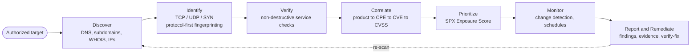
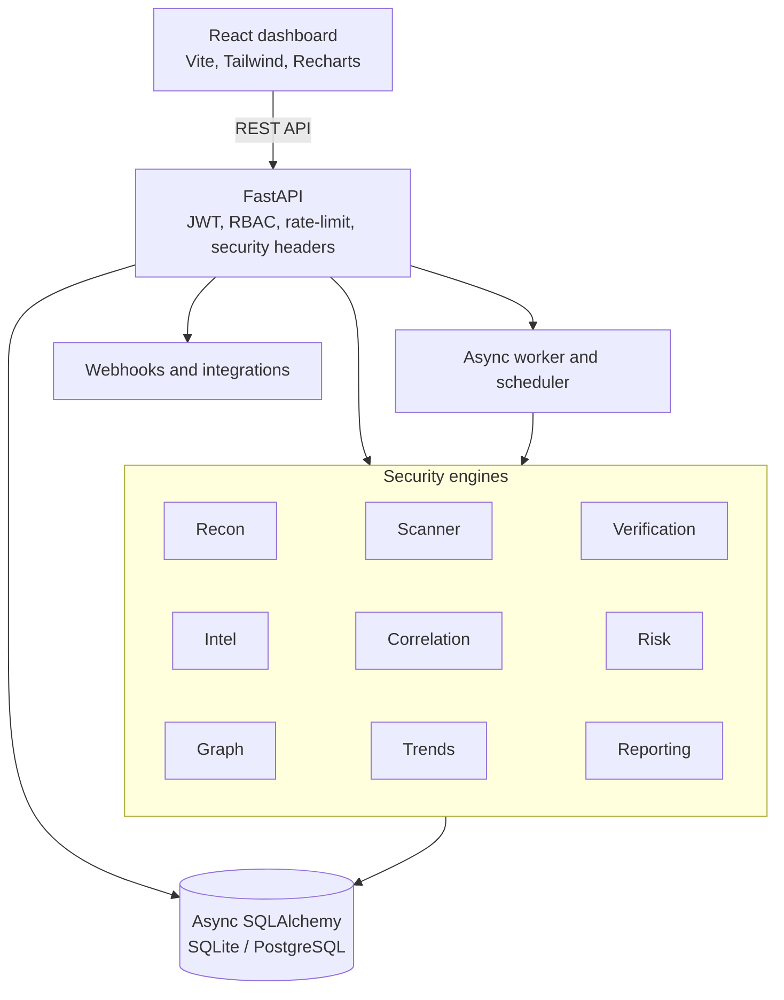
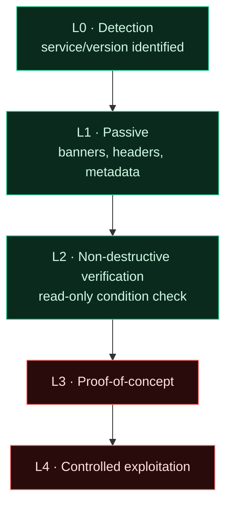
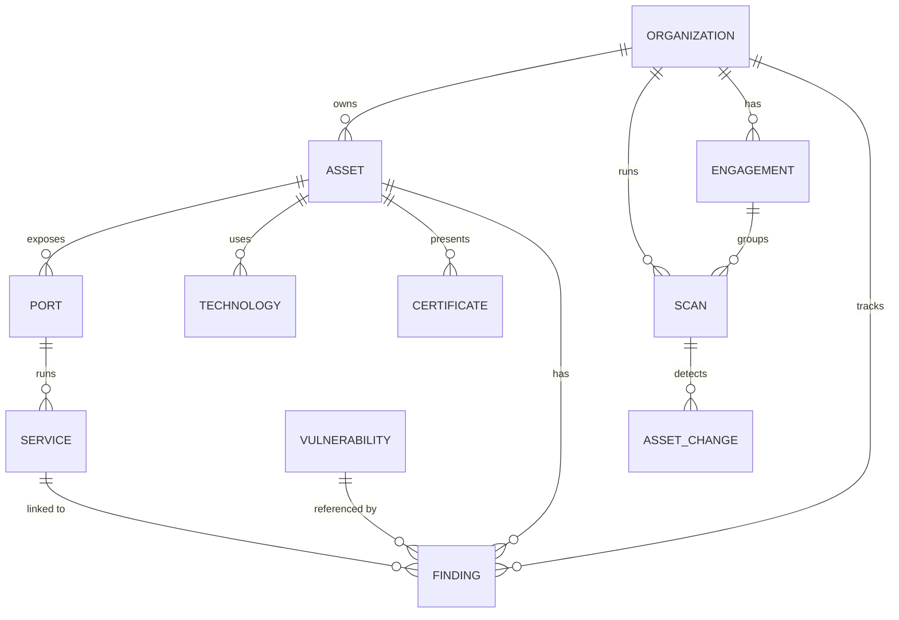
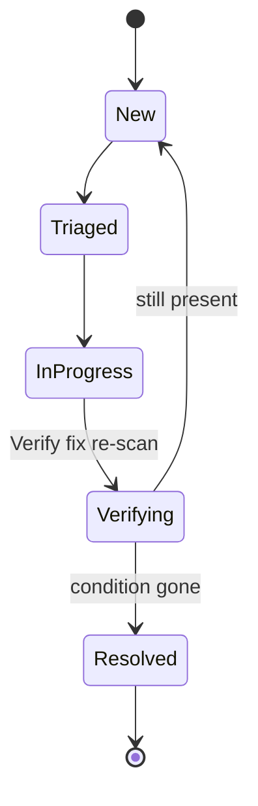

<div align="center">


# ShadowPortX

### Attack Surface Intelligence · Exposure Management · Offensive Security Validation

Discover what an organization exposes to the internet, identify and safely verify the
services running on it, correlate versions with public vulnerability intelligence, prioritize
by real-world exposure — not raw CVSS — and track remediation until the risk is gone.


</div>

> **Authorized assessment only.** Every scan passes a default-deny scope guardrail before a
> single packet is sent. Service checks are non-destructive. Vulnerability handling is
> *intelligence correlation* — never automated exploitation.

---

## Contents

- [What it is](#what-it-is)
- [The problem it solves](#the-problem-it-solves)
- [How it works — the pipeline](#how-it-works--the-pipeline)
- [What each part does](#what-each-part-does)
- [Architecture](#architecture)
- [The SPX Exposure Score](#the-spx-exposure-score)
- [Safe validation model](#safe-validation-model)
- [Data model](#data-model)
- [Remediation lifecycle](#remediation-lifecycle)
- [Dashboard](#dashboard)
- [Quickstart](#quickstart)
- [Deployment](#deployment)
- [Security](#security)
- [Testing & CI](#testing--ci)
- [Project structure](#project-structure)
- [Roadmap](#roadmap)

---

## What it is

ShadowPortX is a self-hostable **External Attack Surface Management (EASM)** and **exposure
intelligence** platform. It turns raw reconnaissance into evidence-backed, prioritized
security findings, continuously monitors the attack surface for change, and gives red teams a
scoped **engagement workspace** with evidence collection and safe finding validation.

It began as a desktop port scanner (preserved in [`legacy/`](legacy/v1.0-desktop/)) and grew
into a full platform: a FastAPI backend with independent security engines, an async job model,
a PostgreSQL/SQLite data layer, and a React security console.

## The problem it solves

Organizations rarely have a reliable, continuously-updated view of everything they expose to
the internet — or which of those exposures actually matters. Traditional scanners dump raw
results and leave engineers to manually correlate assets, services, technologies, and
vulnerabilities. ShadowPortX closes the gap between **"what is exposed?"** and **"what should
we fix first?"**

## What makes it different

Most external attack-surface tools are **closed-source SaaS with a black-box risk score**.
ShadowPortX takes a deliberately different stance:

- **Transparent, contextual risk — not a black box.** The SPX Exposure Score shows its full
  per-factor breakdown on *every* finding (severity × exposure × asset criticality × confidence
  × exploit-intel × verification). You can see, tune, and defend exactly why something ranks where
  it does.
- **Epistemic honesty built into the data model.** Findings carry an explicit maturity state —
  `detected` → `potentially-affected` → `needs-verification` → `confirmed` — so version-correlation
  guesses are never dressed up as confirmed compromise.
- **A principled, auditable validation model.** Safe non-destructive confirmation (L0–L2) is
  implemented; controlled proof-of-concept (L3) and exploitation (L4) are **deliberately not
  enabled**, and the platform never fakes a confirmation.
- **ASM *and* the engagement bridge.** Beyond continuous monitoring, it gives red teams a scoped
  engagement workspace with evidence packages — bridging exposure management and authorized
  assessment in one place.
- **Yours to run and read.** Fully self-hostable and open — data, methodology, and every engine
  are inspectable, versionable, and extendable, with no vendor lock-in.

It doesn't try to replace specialized tools (Nmap, Burp, Nuclei, internet-wide datasets like
Censys). It **orchestrates and contextualizes** discovery, verification, intelligence, and risk
into one transparent, self-hosted workflow.

## How it works — the pipeline



Each stage is an independent engine operating on plain data objects, so it can be tested in
isolation and recomposed by the scan orchestrator.

## What each part does

| Engine / module | What it actually does |
|---|---|
| **Recon** ([`engines/recon`](backend/shadowportx/engines/recon)) | Resolves DNS (A/AAAA/CNAME/MX/NS/TXT/SOA/CAA/DNSSEC), enumerates subdomains from a built-in wordlist (optionally certificate transparency), runs WHOIS, and maps IPs. Builds the asset inventory. |
| **Scanner** ([`engines/scanner`](backend/shadowportx/engines/scanner)) | Async TCP-connect / SYN (scapy) / UDP scanning with controlled concurrency, rate limiting, timeouts and retries. Grabs banners and does **protocol-first** service/version fingerprinting with evidence — so a Jenkins on `:8080` or SSH on `:2222` is still identified correctly. |
| **Verification** ([`engines/verification`](backend/shadowportx/engines/verification)) | Read-only, non-destructive checks that observe whether a security condition actually exists (e.g. "Redis answered `INFO` without auth", "Docker API responded without auth"). Covers Redis, MongoDB, Elasticsearch, memcached, Docker, FTP, SMTP, Grafana, Jenkins, Kibana. |
| **Intel** ([`engines/intel`](backend/shadowportx/engines/intel)) | Normalizes real-world versions (e.g. `8.9p1`) and correlates detected product/version → CPE → CVE → CVSS against a bundled offline dataset. States *"public vulnerability intelligence exists"* — not *"exploited"*. |
| **Correlation** ([`engines/correlation`](backend/shadowportx/engines/correlation)) | Assembles scanner + recon + verification + intel signals into evidence-based findings, each with a detection method, confidence, and evidence-maturity **state** (detected → potentially-affected → confirmed). |
| **Risk** ([`engines/risk`](backend/shadowportx/engines/risk)) | Computes the contextual **SPX Exposure Score** and shows a transparent per-factor breakdown for every finding. |
| **Graph** ([`api/v1/graph.py`](backend/shadowportx/api/v1/graph.py)) | Builds a clickable relationship graph (asset → ip → port → service → technology → vulnerability → finding) and **blast-radius** analysis ("how many assets does this CVE/technology touch?"). |
| **Trends** ([`services/metrics.py`](backend/shadowportx/services/metrics.py)) | Captures a security-posture snapshot at each scan to power trend charts, executive posture deltas, and "why did risk change" contributors. |
| **Validation** ([`services/validation.py`](backend/shadowportx/services/validation.py)) | Safe (L0–L2) confirmation of a finding via read-only verification; honestly marks anything needing L3/L4 as *needs-verification* instead of faking a result. |
| **Reporting** ([`engines/reporting`](backend/shadowportx/engines/reporting)) | Executive + technical reports in JSON / CSV / HTML / PDF. |
| **Worker + Scheduler** ([`worker/`](backend/shadowportx/worker)) | Async job execution off the request path, plus recurring scheduled scans for continuous monitoring. |
| **Notifications** ([`services/notifications.py`](backend/shadowportx/services/notifications.py)) | Outbound webhooks (Slack/Teams/Discord/generic) on new high/critical findings — the extension point for enterprise connectors. |

## Architecture



**Stack:** Python 3.11+ · FastAPI · async SQLAlchemy 2.0 · Pydantic v2 · httpx · dnspython ·
cryptography · reportlab · React 18 · Vite · Tailwind · Recharts · Docker · GitHub Actions.

## The SPX Exposure Score

CVSS measures a vulnerability's intrinsic severity. **SPX-ES** answers *"what should this
organization fix first?"* by combining severity with real-world context:

```
SPX-ES = 100 · Σ (weightᵢ · factorᵢ) + modifiers        (clamped 0–100)

  severity        0.35   normalized CVSS / qualitative rank
  exposure        0.20   internet-facing > limited > internal
  criticality     0.15   business criticality of the asset
  confidence      0.10   detection confidence
  exploit_intel   0.10   public exploit / KEV known
  verification    0.10   was a security condition actually observed
```

The same CVSS 9.8 can score **100** on an internet-facing production asset and **~60** on an
internal dev box. Weights are configurable; the full breakdown is shown on every finding.

## Safe validation model



Levels **0–2 are implemented** (read-only). Levels **3–4 are deliberately not enabled** — the
platform never runs exploitation and never fabricates a confirmation.

## Data model



## Remediation lifecycle



## Dashboard

A SOC/ASM-style console with pages for Overview, Assets (+ detail), Services, Technologies,
Vulnerabilities, Findings (+ detail with evidence & SPX-ES breakdown), Changes, **Asset
Graph**, Risk, **Trends**, Scan History, **Engagements**, Monitoring, Integrations, Scope, and
Reports. Dark, dense, and keyboard-friendly — severity is never conveyed by color alone.

## Quickstart

**Backend (API):**
```bash
cd backend
python -m venv .venv
./.venv/Scripts/pip install -e ".[dev]"      # Windows  (Linux/macOS: .venv/bin/pip)
./.venv/Scripts/python -m uvicorn shadowportx.main:app --reload
```

**Frontend (dashboard):**
```bash
cd frontend
npm install
npm run dev            # http://localhost:5173  (proxies /api → :8000)
```

**Demo data** (spins up local fake services and runs real scans):
```bash
cd backend && ./.venv/Scripts/python scripts/seed_demo.py
```

**Single process** (API also serves the built dashboard at `/`):
```bash
cd frontend && npm run build && cp -r dist ../backend/webui
cd ../backend && ./.venv/Scripts/python -m uvicorn shadowportx.main:app   # http://localhost:8000
```

**CLI:**
```bash
python -m shadowportx.cli scan 127.0.0.1 --ports top1000 --json report.json
```

**Validation lab** (vulnerable + hardened services on localhost):
```bash
cd lab && docker compose up -d
```

Default dev login: `admin@shadowportx.local` / `shadowportx` (override with `SPX_ADMIN_PASSWORD`).

## Deployment

**Full stack with Docker Compose** (PostgreSQL + backend + dashboard):
```bash
cd deploy && docker compose up --build     # dashboard :8080 · API :8000
```

**Vercel (dashboard) + hosted backend.** The dashboard deploys to Vercel as a static SPA
([`frontend/vercel.json`](frontend/vercel.json)); point it at the backend with
`VITE_API_BASE`. The backend (which needs raw sockets and long-running jobs) runs on a
container host (Docker/Render/Railway/Fly/VPS). Set `SPX_CORS_ORIGINS` to the dashboard origin.
See [`docs/DEPLOY.md`](docs/DEPLOY.md).

## Security

See [`SECURITY.md`](SECURITY.md). Highlights: default-deny scope enforcement, JWT + RBAC,
non-destructive verification (no exploitation), security headers, per-IP API rate limiting,
Pydantic input validation, ORM-parameterized queries, audit logging, env-only secrets (the
server refuses to boot in production with a weak key), and CI-enforced `ruff` + `bandit` +
`pip-audit`.

## Testing & CI

```bash
cd backend && pytest -q          # 50 tests across engines, pipeline, graph, trends, engagements, API
ruff check . && bandit -c pyproject.toml -r shadowportx
```
GitHub Actions ([`.github/workflows/ci.yml`](.github/workflows/ci.yml)) runs lint, SAST,
dependency audit, tests with coverage, the frontend build, and Docker image builds on every push.

## Project structure

```
backend/shadowportx/   FastAPI app, engines, services, worker, data model
frontend/src/          React dashboard (pages, components, API client)
lab/                   validation lab (vulnerable + hardened services)
deploy/                docker-compose full stack
docs/                  deployment & architecture docs
legacy/v1.0-desktop/   the original desktop scanner (preserved)
```

## Roadmap

SSO/SAML/OIDC + MFA · hardened multi-tenant isolation & teams · vendor connectors
(Jira/ServiceNow/Splunk/Sentinel) on the notification interface · Celery/Redis workers ·
Kubernetes deployment.

## License

[MIT](LICENSE). Authorized use only — assess only systems you own or are permitted to test.
